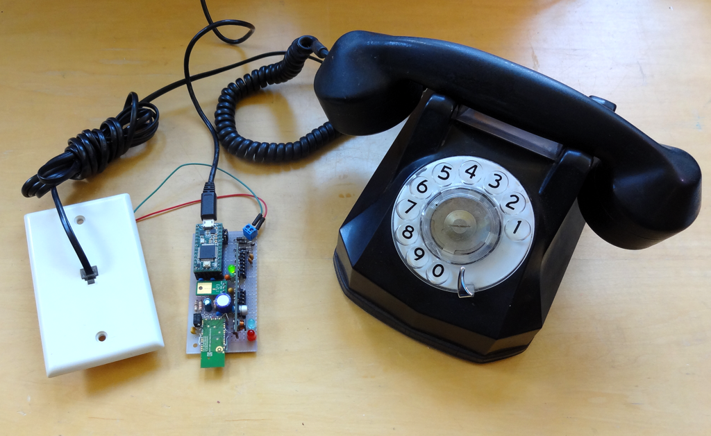
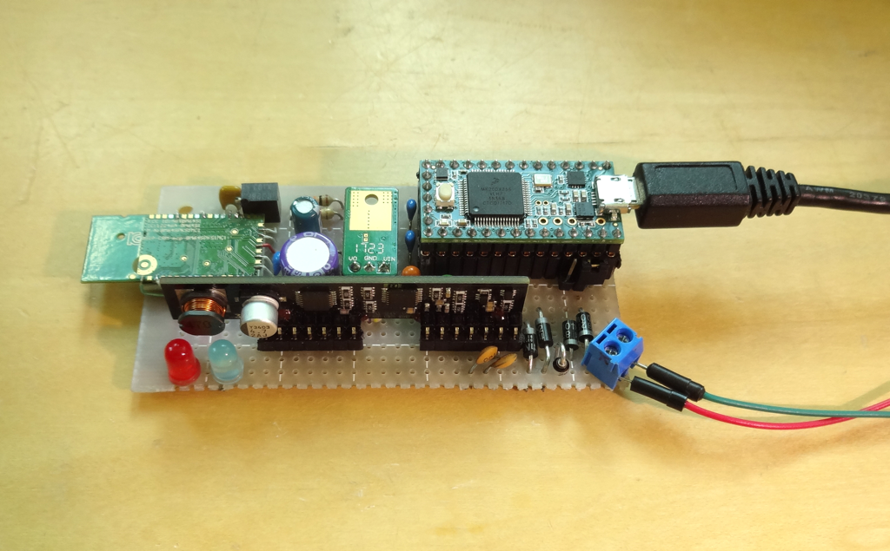
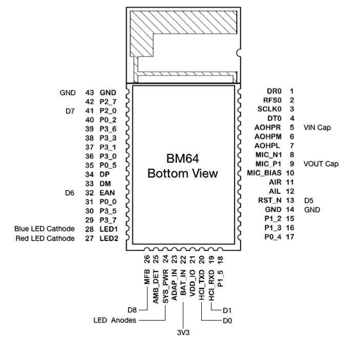
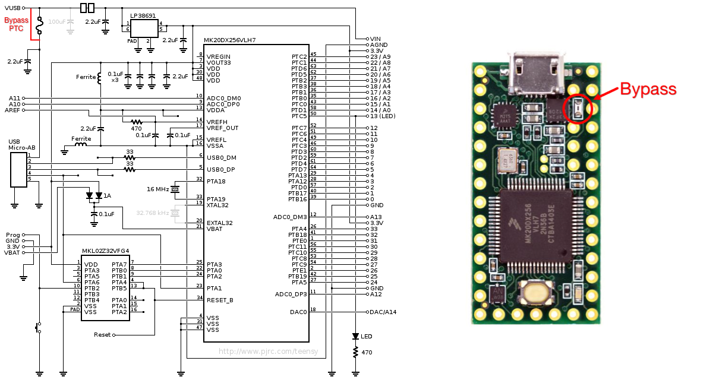

# Blue POT


Blue POT is an open-source Bluetooth telephone "central office" that works with unmodified DTMF or Rotary dial telephones.  It allows picking up or placing calls through a paired Android or IOS cell phone using attached POTs phones (up to 3).  It drives the 2-wire subscriber line and is designed for on-premise use (e.g. connecting to the existing telephone wiring in a home but not driving long distance lines outside of a building).  Blue POT is based on three main subsystems.

1. [Microchip BM64 Module](https://www.microchip.com/wwwproducts/en/BM64) providing Bluetooth Handsfree (HF) / Headset (HS) support.  Available at [Mouser](https://www.mouser.com/ProductDetail/579-64SPKS1MC10001AA).
2. [Silvertel AG1171 SLIC](https://www.silvertel.com/telecom/271-ag1171.html) (Subscriber Line Interface Circuit) providing bias and ring voltages, hook detection and audio interface to the telephone line.  Available at [Symmetry Electronics](https://www.semiconductorstore.com/cart/pc/viewPrd.asp?idproduct=13904).
3. [PJRC Teensy 3.2](https://www.pjrc.com/store/teensy32.html) controller providing system control, DTMF and Rotary dialing decoding and telephone tone (dial-tone, busy and reciever off-hook) generation.  Code is developed and loaded using the Arduino environment with the PJRC Teensy extensions (including the [Audio Library](https://www.pjrc.com/teensy/td_libs_Audio.html) used for tone generation and DTMF decoding).


Additional information about the design is documented at [hackaday.io](https://hackaday.io/project/166359-blue-pot).

## Repository Contents
This repository contains the code, hardware design, documentation and supporting files to enable someone to make their own Blue POT.

* The ```bm64``` directory contains a zip file containing the software that runs on a Windows PC and the configuration file that must be loaded into the BM64 module for it to work with Blue POT.  See the section "BM64 Configuration" below.
* The ```code``` directory contains the Teensy 3.2 sketches.
* The ```docs``` directory contains specifications and datasheets for the modules used in the design.
* The ```eagle``` directory contains the hardware design.
* The ```pictures``` directory contains the pictures used by this readme as well as other useful images. 

## Blue POT Prototype


The hand-wired Blue POT prototype is my design/test platform.  Its schematic is ```eagle/blue_pot_proto_schem.pdf```.  It runs the ```code/blue_pot_proto``` sketch with the following functionality.

* Up to 8 Bluetooth pairings
* Support for 10-digit dialing using DTMF or Rotary
* Support for Voice dialing (Siri or Google Voice) "operator" by dialing '0'
* Generates Receiver Tones
	* Busy signal when the reciever is lifted and the cellphone is not connected via Bluetooth
	* Dial tone when the reciever is lifted and the cellphone is connected via Bluetooth to indicate dialing is possible
	* Receiver Off Hook fast pulsing tone when the receiver has been off-hook for more than 60 seconds without an ongoing phone call
* Rings phone on received calls
* Automatically connect to a cellphone when available
* Simple serial command interface

The prototype is completely functional with the limitation that it only supports 10-digit dialing.  It also has a slight problem with noise from the Bluetooth module being coupled back into the audio when the module is far from the phone and increases its RF output power.  I use the higher power Class 1 module (+15 dBm typ output power).

The BM64 module is connected deadbug style as shown below.


### Bluetooth Pairing with a cellphone
The BM64 allows pairing with multiple cellphones.  It will enter a pairing mode upon being powered on if it has not been paired before.  It will remain in pairing mode for a limited time.  The firmware running on the Teensy provides a simple command interface through the serial port that can be accessed via the Arduino IDE Serial Monitor.  This command interface provides two commands to manage pairing and tell Blue POT which of multiple pairings to automatically connect too.

1. Type ```L``` and hit Send to command the BM64 to enter pairing mode.  The Red and Blue LEDs will flash.  Use the Bluetooth Settings on your phone to pair with "Blue POT".  The BM64 stores pairings in order.  The first pairing is 0, the second is 1 up to eight pairings (pairing 7).
2. Type ```D``` and hit Send to display the current active pairing (0-7).
3. Type ```D=<n>``` where <n> is a valid pairing (0-7) and hit Send to configure the active pairing ID. This is stored in the Teensy's EEPROM to configure the BM64 when power is applied to the Blue POT.  The default pairing ID is 0 so this command is unnecessary if only one phone is paired with the Blue POT.

Type ```H``` and hit Send to get a list of all commands.

## Blue POT PCB
Hopefully coming with an LCD/button user interface and more dialing functions!

## BM64 Configuration
The Microchip BM64 Bluetooth module is primarily designed as a controller for Bluetooth Audio (e.g. Bluetooth speakers) but also supports the Handsfree/Headset protocols used by telephony.  However it must be configured through its serial port with software running on a Windows PC for use in this application with the Blue POT firmware.  The firmware running on the Teensy has a special serial pass-through mode entered by including a jumper when it is powered on.  This allows the Blue POT to communicate with the PC software with the Teensy acting as a simple USB UART (its telephony function is disabled).

A full description of the process of running the various PC utilities is described on the "BM64 Evaluation Board (EVB) User's Guide" included as the ```docs/50002514B.pdf``` file.  See section 3.4 on page 27.  You should read this as you may ultimately want to create a custom configuration for your BM64. The entire process consists of running several programs to create two configuration files, combine them and then load them into the BM64 EEPROM.  However I provide the combined file ```bm64/bluePOT.ipf``` that can be directly loaded via the serial interface with the Blue POT in the pass-through mode using the EEPROM Tool utility.

1. Copy the ```bin/bluePOT.ipf``` and ```bin/IS2064_BM64 Software & Tools.zip``` files to your PC and unzip the tools into a temporary directory.
2. Unzip and run the EEPROM Tool utility (```EEPROM_Tool_V4851.exe```).
3. Insert the jumper connecting Teensy D23 to ground and then plug the Blue POT into your PC via the Teensy's USB connector.  Be sure the jumper is installed before connecting the USB.
4. Follow the directions in the ```50002514B.pdf``` evaluation board guide starting in section 3.5 on page 50 to load the ```bluePOT.ipf``` file into your BM64 module with the following caveats.

	* Figure 3-31 does not apply.  The firmware will automatically place the BM64 module into the appropriate mode.
	* Replace the file described in Figure 3-35 with ```bluePOT.ipf``` at the location you stored it.

After the write finishes, remove the jumper and power cycle the Blue POT.  If you have connected to your PC with a serial terminal open it will display ```pairID = 0```.

## Notes
1. Additional information I found useful while working on this project:

	* Jean Wlodarski's great [Vintage Bluetooth Headphone](https://pickandplace.wordpress.com/) conversion using the BM64 module.
	* Anders Nelson's [Bluetooth to POTs adapter](https://www.andersknelson.com/blog/?p=187).
	* The Tech-FAQ [Telephone Tone Frequencies](http://www.tech-faq.com/frequencies-of-the-telephone-tones.html) table.
	* Joe Randolph's [articles about Telephone line interfaces](http://www.randolph-telecom.com/articles-faq.html).
	* An epanorama.net [article about ringing voltages](http://www.epanorama.net/circuits/telephone_ringer.html).
	* This [blog post about driving the AG1171](https://blog.goo.ne.jp/sirius506/c/d1add04588c82beebd42a3e12ac16b15).
	* Cisco's article about [Voice Network Signaling and Control](https://www.cisco.com/c/en/us/support/docs/voice/digital-cas/14007-net-signal-control.html).
	* A great collection of telephone history [links](https://www.mhelpdesk.com/history-of-telephone-communication/).

2. The AG1171 SLIC module and supporting protective circuitry is designed to support lines of up to about 1000 feet inside a premise (e.g. inside the home).  It provides protection for ESD/EMI but not for lighting strikes.  Do not omit including the protection circuitry from your build as the AG1171 can be damaged.  Make sure that the telephone wiring is disconnected from outside lines (e.g. the lines that originally connected to the central office).  Silvertel has a document describing additional protection circuitry necessary for driving longer/outside lines.

3. Power to the system may be provided using a 5V USB Adaptor capable of providing more than 500 mA (or host computer) connected to the Teensy Micro-USB port.  However the Teensy protective PTC (thermal fuse) must be bypassed because it will trip from the inrush current for the AG1171 3.3V power supply.  It may be removed and a wire soldered across the pads or a wire carefully soldered across the PTC terminals.  Alternatively you can supply power to the system via the Teensy VIN pin or VUSB pad.



## Questions?

Contact the designer - dan@danjuliodesigns.com